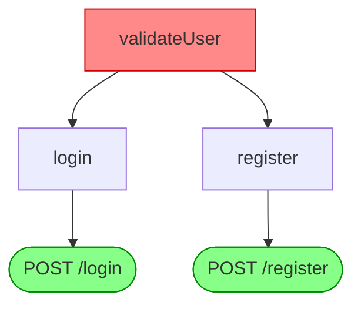

# Kịch bản Demo: Security Radar trên Repository GitHub Bất Kỳ

Tài liệu này hướng dẫn cách sử dụng script `analyze-github.py` để quét tự động lỗ hổng bảo mật (OWASP Top 10) và vẽ bản đồ ảnh hưởng (Impact Graph) trên **bất kỳ repository GitHub nào**. Đây là phần minh họa cho tính năng phân tích độc lập (Zero-footprint) mà không cần can thiệp trực tiếp vào mã nguồn của dự án đang chạy.

> 📎 Demo này = phân tích **repo ngoài** qua script. Muốn demo pipeline CI (PR comment + SARIF tab Security) trên app mẫu có sẵn → xem [`run-demo.md`](run-demo.md).

## 1. Mục đích

- **Xác định lỗ hổng (Security Scan)**: Chạy công cụ quét với bộ rules `p/owasp-top-ten` (các lỗ hổng phổ biến nhất) và các rule tự định nghĩa (ví dụ: hardcoded JWT, SQL injection) trên thư mục được clone về.
- **Vẽ bản đồ ảnh hưởng (Impact Map)**: Tự động trích xuất luồng phụ thuộc (blast radius). Nếu chọn một nhánh (`--branch`), sẽ chỉ ra các thay đổi code đã ảnh hưởng đến những API endpoint hay chức năng nào. Nếu chỉ định `--function`, sẽ hiển thị luồng cụ thể của hàm đó kèm sơ đồ Mermaid.

## 2. Chuẩn bị

Đảm bảo bạn đã cài đặt các công cụ:
- **Git**
- **Semgrep** (Cài đặt: `python -m pip install semgrep` nếu chạy native, hoặc cài thông qua pipx/docker)
- **Security Radar**: `python -m pip install -e .`

## 3. Cách chạy Demo

Script chạy nằm tại thư mục `scripts/analyze-github.py`.

### Cú pháp:

```bash
python scripts/analyze-github.py --url <GITHUB_URL> [--branch <BRANCH>] [--function <FUNCTION_NAME>]
```

### Kịch bản 1: Phân tích Impact của một nhánh (Diff Branch)
Giả sử bạn muốn xem nhánh `feature/new-api` của một repo đã thay đổi những gì và ảnh hưởng đến đâu:

```bash
python scripts/analyze-github.py --url https://github.com/username/project.git --branch feature/new-api
```
**Kết quả dự kiến:**
1. **Security Scan**: Quét nhánh `feature/new-api` và xuất danh sách lỗ hổng OWASP nếu có.
2. **Impact Map**: Phân tích sự khác biệt (diff) giữa nhánh `feature/new-api` và nhánh chính (`main`), sau đó in ra bảng tóm tắt: "Thay đổi hàm X → Ảnh hưởng API Y, Z".

### Kịch bản 2: Truy vết một Function cụ thể (Vẽ luồng)
Giả sử bạn biết một hàm cốt lõi (ví dụ `validateUser`) vừa được sửa và muốn xem nó lan truyền đến những API endpoint nào:

```bash
python scripts/analyze-github.py --url https://github.com/username/project.git --function validateUser
```
**Kết quả dự kiến:**
1. **Security Scan**: Liệt kê các cảnh báo bảo mật.
2. **Impact Map**: In ra dạng cây (Tree) và **mã Mermaid**. Bạn có thể copy mã Mermaid dán vào [Mermaid Live Editor](https://mermaid.live/) hoặc chèn vào file Markdown trên GitHub để xem biểu đồ trực quan.

## 4. Minh họa kết quả (Expected Output)

Khi chạy thành công, output sẽ bao gồm:

```text
╭──────────────────────────────────────────────────╮
│ 🚀 Starting Security Radar Analysis              │
│ Target: https://github.com/username/project.git  │
│ Branch: (default)                                │
╰──────────────────────────────────────────────────╯

1. Cloning repository...
Cloning into '/tmp/repo'...

2. Running Security Scan (OWASP Top 10 + Custom Rules)...
[Radar Scan Output hiển thị các lỗi như Injection, XSS, Hardcoded Secret...]

3. Analyzing Impact Graph...
   Tracing blast radius for function: validateUser
[Tree View hiển thị API bị ảnh hưởng]

   Mermaid Graph (Copy to GitHub/Mermaid Live):

