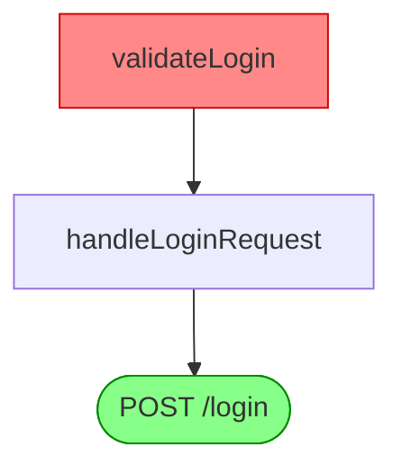

# Kịch bản Demo cho sếp — `security-radar` trên repo GitHub bất kỳ

Kịch bản trình diễn (~5–7 phút) chứng minh tool chạy được trên **bất kỳ repo GitHub open-source nào** — không giới hạn trong app demo có sẵn. Thông điệp: *"Cài 1 lần, chĩa vào repo bất kỳ, ra ngay 3 thứ — lỗ hổng OWASP, bản đồ ảnh hưởng, và bảng xếp hạng rủi ro."*

> 📎 Muốn demo pipeline CI (PR comment + SARIF tab Security) trên app mẫu → xem [`run-demo.md`](run-demo.md).

---

## 1. Thông điệp cho sếp (nói trước khi gõ lệnh)

| Năng lực | Trả lời câu hỏi | Lệnh |
|---|---|---|
| **Security Scan** | "Repo này có lỗ hổng OWASP nào?" | `radar scan` |
| **Impact Graph** | "Sửa hàm/API này thì lan tới đâu?" | `radar impact` |
| **⭐ Risk Ranking** | "Trong hàng chục finding, **fix cái nào trước**?" | `radar report` / `radar triage` |

Điểm nhấn: **zero-footprint** (không ghi file nào vào repo target) và **Risk Ranking chạy được không cần API key** — sếp không phải lo chi phí AI để thấy giá trị.

---

## 2. Chuẩn bị (làm trước buổi demo)

```bash
python -m pip install -e .          # cài radar
radar --help                        # phải in 8 lệnh
```

Cần: **Git** + **Semgrep** (native `semgrep` trên PATH hoặc Docker Desktop bật — cho `scan`).
`impact` và Risk Ranking base score **không cần** Semgrep/API key.

> 💡 **Mẹo demo mượt**: clone trước repo định trình diễn (script tự cache vào `analysis_repos/`) để khỏi chờ tải mạng lúc đứng trước sếp.

---

## 3. Phần A — Chạy script tự động (scan + impact)

Script `scripts/analyze-github.py` clone repo → quét OWASP → vẽ impact graph. Chạy tương tác hoặc truyền tham số:

```bash
# Tương tác (hỏi URL / branch / function):
python scripts/analyze-github.py

# Hoặc truyền thẳng — trace 1 function (đẹp nhất để demo):
python scripts/analyze-github.py --url https://github.com/OWASP/NodeGoat.git --function validateLogin
```

Output (terminal + lưu file):

| File | Nội dung |
|---|---|
| `analysis_results/<repo>_semgrep_results.json` | Findings OWASP + custom rules |
| `analysis_results/<repo>_impact_graph.html` | Impact graph tương tác (mở browser) |
| `analysis_results/<repo>_impact_graph.md` | Sơ đồ Mermaid (dán vào GitHub/Mermaid Live) |

Repo được cache ở `analysis_repos/<repo>/` — lần sau chỉ `git fetch`, không clone lại.

**Talking point khi trace function:** *"Đây — sửa `validateLogin` thì 3 API endpoint này gãy theo. Reviewer thấy ngay quy mô PR thay vì đọc code thuần."*



---

## 4. Phần B — ⭐ Risk Ranking (điểm nhấn cho sếp)

Script chạy `scan` + `impact`. Để khoe **xếp hạng rủi ro** — câu hỏi sếp quan tâm nhất (*"fix cái nào trước?"*) — chạy thêm trên repo đã cache:

```bash
# Dashboard hợp nhất: findings xếp theo Risk Score + impact + history → 1 file HTML
radar report analysis_repos/NodeGoat --out boss-dashboard.html

# Gate "có răng" — exit≠0 nếu có finding rủi ro cao (KHÔNG cần API key):
radar triage analysis_repos/NodeGoat --top 5          # 5 finding nguy hiểm nhất
radar triage analysis_repos/NodeGoat --min-risk 80    # chặn PR nếu có risk ≥ 80
```

Mở `boss-dashboard.html` → cột **Risk** (điểm 0–100 + band: critical/high/medium/low), bảng **sort risk giảm dần**, `noise`/`false_positive` gấp vào fold.

**Talking point:** *"Tool không đổ một đống cảnh báo ngang hàng. Nó tính điểm `severity × khả năng tiếp cận × loại OWASP` rồi đẩy bug nguy hiểm nhất lên đầu. Hover cột Risk thấy luôn lý do tính điểm — không black-box."*

### (Tùy chọn) Nâng cấp bằng AI

Có `OPENAI_API_KEY` thì AI đánh giá exploitability và **ghi đè thứ hạng** (`exploitable` → critical, `false_positive` → fold):

```bash
export OPENAI_API_KEY=sk-...        # PowerShell: $env:OPENAI_API_KEY="sk-..."
radar report analysis_repos/NodeGoat --triage --out boss-dashboard.html
```

Thiếu key → tự render bản offline (vẫn có Risk Ranking), **không lỗi** — an toàn khi demo.

---

## 5. Kết quả mẫu đã kiểm chứng (NodeGoat)

Đã chạy `radar scan --rules-only` trên [OWASP/NodeGoat](https://github.com/OWASP/NodeGoat):

- **8 findings** (5 ERROR · 3 WARNING): eval injection (A08), SSRF (A10), XSS (A03), NoSQL injection, open redirect (A01), plaintext password (A07), session fixation (A07), ReDoS (A05).
- **Impact graph** trace đúng `validateLogin → handleLoginRequest`, `searchCriteria → displayAllocations`.
- **True negative**: `js-sql-string-concat` không false-positive trên MongoDB.

---

## 6. Phụ lục — Đọc kết quả

**Risk Score (công thức, giải thích được):**

```
base = severity_w × reach_mult × class_w           (không cần key)
  severity_w : ERROR 60 · WARNING 35 · INFO 15
  reach_mult : reachable → 1.0 + 0.1·min(routes,5) ; unknown → 0.6
  class_w    : A03/A08 1.3 · A01/A10 1.1 · còn lại 1.0
band         : ≥80 critical · ≥60 high · ≥35 medium · ≥15 low · còn lại noise
```

**Impact graph:**
- **depth** — số bước lan từ hàm bị sửa (caller trực tiếp = depth 1).
- **⚠ approx** — edge khớp tên toàn cục (name-only), chưa chắc 100%.
- **feature** — map từ glob trong `radar.config.yml` (không có config → `(unmapped)`).
